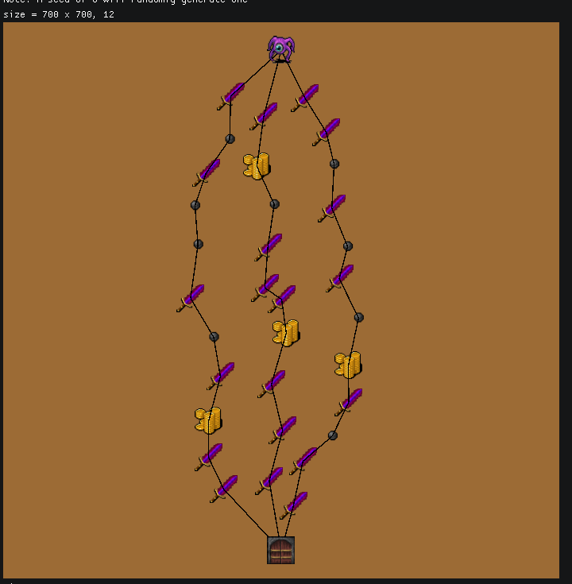
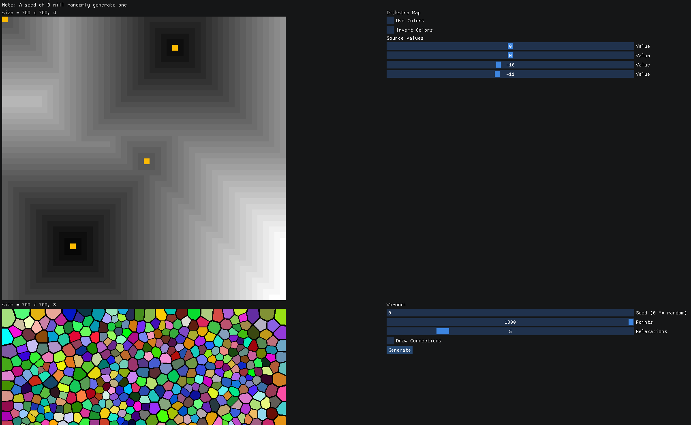
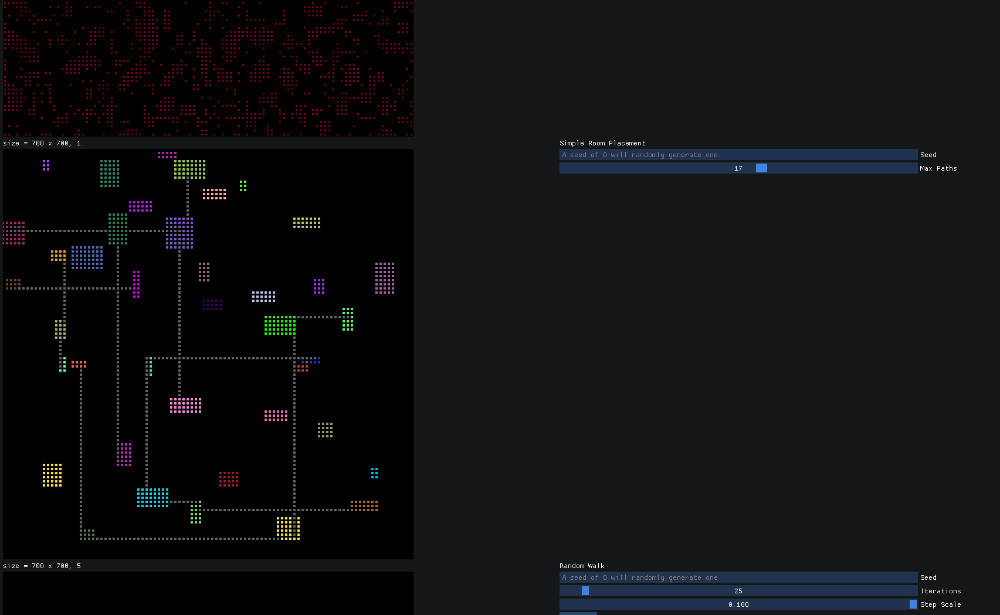

 | 

This project is a collection of some procedural map generation algorithms inspired by https://christianjmills.com/posts/procedural-map-generation-techniques-notes/.
The algorithms are presented in a GUI (imgui).

Currently implemented are:
* Simple Room Placement
* Cellular Automata
* Random Walk
* Dijkstra Maps
* Roguelike Path Generation (VogelDisk + BowyerWatson + AStar)
* Noise Generator ([FastNoiseLite](https://github.com/Auburn/FastNoiseLite))
* Voronoi ([jc_voronoi](https://github.com/JCash/voronoi))

Textures are from https://opengameart.org/content/dungeon-crawl-32x32-tiles-supplemental

This program can be build through *meson*.